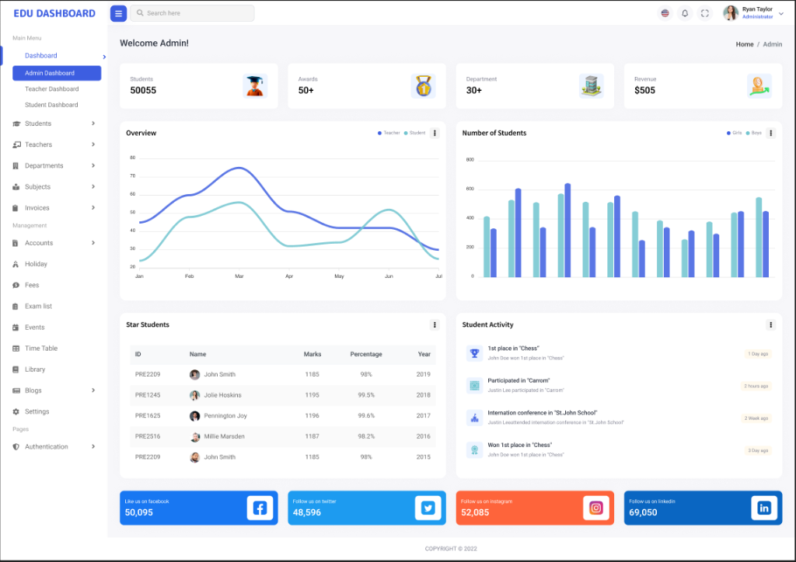
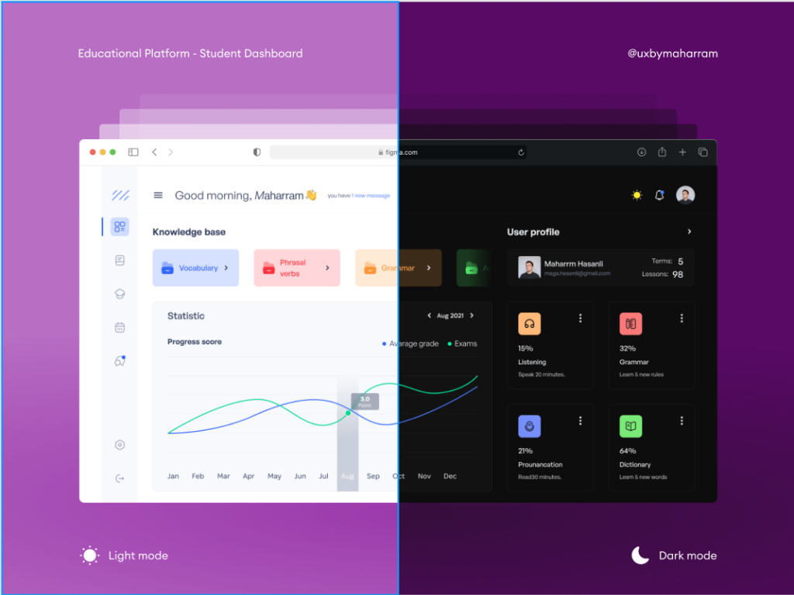

# Referências de Design (Figma)

Aqui documentamos os templates do Figma que serviram de inspiração para o design do EduTrack AI, incluindo os links, o que achamos interessante em cada um, e os screenshots para referência.

## 1. Dashboard com Foco em Dados
**Link:** [Template Figma 1](https://www.figma.com/community/file/1214641066851863180)

**Por que é útil:**
Gostei da forma como o template foca em demonstrar o progresso do estudante utilizando dados e gráficos autoexplicativos. Foi por essa via de clareza e análise visual que decidi seguir na criação do app.

**Screenshot:**

---

## 2. Educational Platform - Student Dashboard (Light and Dark Mode)
**Link:** [Template Figma 2](https://www.figma.com/community/file/1038033084068266047/educational-platform-student-dashboard-light-and-dark-mode)

**Por que é útil:**
Gostei de como esse template deixa as informações organizadas e agradáveis visualmente para o estudante. Um grande diferencial é a possibilidade de alternar a interface entre os modos *Light* ou *Dark*.

**Screenshot:**

